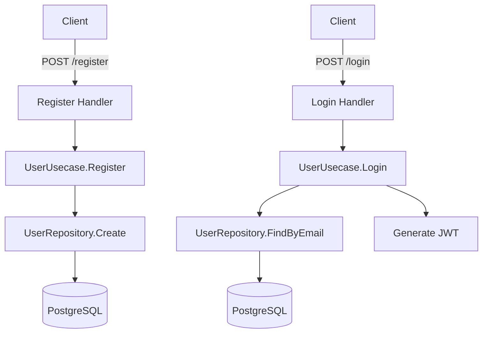
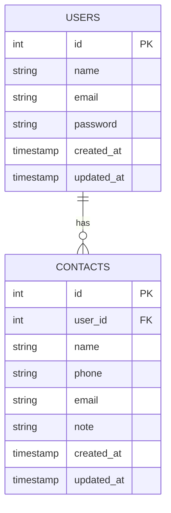

<div align="center">
    <p>
        <a href="https://github.com/404NotFoundIndonesia/" target="_blank">
            
        </a>
    </p>

 [](https://github.com/404NotFoundIndonesia/contact-management/stargazers)
 [](https://github.com/404NotFoundIndonesia/contact-management/blob/main/LICENSE)
 
</div>

# Fiber Contact API

API sederhana dengan Golang (Fiber) + PostgreSQL untuk registrasi, login, dan manajemen kontak (CRUD) menggunakan pendekatan **DDD (Domain-Driven Design)** dan **Repository Pattern**.

---

## ✨ Features

- 🔐 User Register & Login (JWT)
- 👤 CRUD Kontak
- 🧠 Clean Architecture (DDD & Repository)
- 🐘 PostgreSQL Database
- ⚡ Fiber (Express-style Go web framework)

---

## 🗂️ Backend Folder Structure

```
.
├── cmd/                        # Entry Point
│   └── main.go
├── internal/
│   ├── domain/                 # Entity & interface
│   ├── handler/                # HTTP handlers
│   ├── infrastructure/         # Repository impl
│   ├── middleware/             # JWT middleware
│   └── usecase/                # Business logic
├── migrations/                 # SQL table schema
├── go.mod / go.sum
└── .env
```

---

## 🔃 Flowchart (Register & Login)



---

## 🧩 ERD (Entity Relationship Diagram)



---

## ⚙️ Setup & Run

### 1. Clone & Install Dependencies

```bash
git clone https://github.com/your-username/fiber-contact-api.git
cd fiber-contact-api
go mod tidy
```

### 2. Environment

Buat file `.env`:

```env
PORT=3000
DB_HOST=localhost
DB_PORT=5432
DB_USER=postgres
DB_PASSWORD=yourpassword
DB_NAME=yourdb
JWT_SECRET=your_jwt_secret
```

### 3. Database Setup

```bash
# PostgreSQL
psql -U postgres -d yourdb -f migrations/create_users_table.sql
psql -U postgres -d yourdb -f migrations/create_contacts_table.sql
```

### 4. Run App

```bash
go run main.go
```

---

## 📬 API Endpoints

### Auth
| Method | Endpoint      | Description        |
|--------|---------------|--------------------|
| POST   | `/api/register` | Register user      |
| POST   | `/api/login`    | Login & get token  |

### Contacts (JWT Required)
| Method | Endpoint           | Description          |
|--------|--------------------|----------------------|
| POST   | `/api/contacts`    | Create new contact   |
| GET    | `/api/contacts`    | List all contacts    |
| GET    | `/api/contacts/:id`| Get single contact   |
| PUT    | `/api/contacts/:id`| Update contact       |
| DELETE | `/api/contacts/:id`| Delete contact       |


---

## 🧑‍💻 Author

**404 Not Found Indonesia**

Contributor: 
- [@iqbaleff214](https://github.com/iqbaleff214)

---

## 🧪 License

This project is open-sourced software licensed under the [MIT license](LICENSE).